# CampusRide-React-Express-MySQL
The project is an full stack implementation including database design for the campus ride appointment system of golf cart and campus auto at UNC Charlotte. 

The main structure of the repository is as below:

    .
    ├── Frontend                   # Frontend directory: React 4 + BootStrap 4 
    │   ├── public                 # Static file directory: contains css, bootstrap, javascript for the views
    │        ├── ...
    │   ├── src                    # React file directory
    │        ├── api               # Http api communicate to backend API
    │             ├── public.js    # Public api without user authentification
    │             ├── student.js   # Private api require user authentification
    │        ├── Auth                   # Auth0 user authentification 
    │            ├── auth0-variables.js # The configuration of Auth0: ** you should setup your own auth0 server here **
    │            ├── Auth.js            # Authentification api via Auth0
    │        ├── components
    │            ├── appointments  # Appointment page
    │            ├── main          # Main page
    │            ├── student       # Profile page
    │            ├── timetable     # Auto & cart timetable page
    │            ├── Callback.js   # Callback page: store the authentification token
    │            ├── NaviBar.js    # Navigation component
    │            ├── SideBar.js    # SideBar component
    │            ├── ...
    │        ├── index.js          # The root react component: react application entry point
    │        ├──
    │   ├── package.json           # Required node js modules
    ├── Backend                    # Backend API directory: Node.js + Express 
    │   ├── public                 # Public files: no need for this app, just express generator legacy
    │        ├── ...
    │   ├── routes                 # Main API directory which communicates to the frontend api
    │       ├── public.js          # Public API: receive queries from frontend API and send response data back     
    │       ├── Student.js         # Authentification required API: receive and process requests from frontend API 
    │       ├── utilities.js       # SQL helper functions
    │   ├── utils                  # Database API & Authentification directory
    │       ├── auth0-variables.js       # Auth0 configuration: ** you should setup your own auth0 server here **
    │       ├── database-variables.js    # MySQL configuration: ** you should setup your own mysql server here **
    │       ├── database-mysql.js        # Synchronized mysql api
    │       ├── database-mysql2.js       # Asynchronized mysql2 api
    │       ├── jwtcheck.js              # JWT authentification middleware
    │       ├── user.js                  # Auth0 & MySQL related api
    │   ├── view                   # Jade template directory: little need for this app, just express generator legacy and debug use
    │   ├── package.json           # Required node js modules
    ├── mysql-database             # MySQL database directory
    │   ├── Dump-CampusRide.sql    # Mysql dump file  
    │   ├── test-data-generator
    │       ├── schedule.py        # Python helper function for generate test data for auto and cart schedule
    └── README.md

## Index
* [Setup and Run](#setup-and-run)
* [Development Starting Point and Framework](#development-starting-point-and-framework)
* [Business Rules and Assumptions](#business-rules-and-assumptions)
* [Web UI](#web-ui)
* [EERD](#eerd)
* [Data Dictionary](#data-distionary)
* [SQL Implementation Details](#sql-implementation-details)
	* [Stored Procedure](#stored-procedure)
	* [Trigger](#trigger)
	* [CRUI API](#crui-api)
	* [View](#view)
	* [Indexes](#indexes)
* [ToDo(Future Work)](#todo(future-work))
* [References](#references)

## Setup and Run

* Node.js enviroment setup
  
  Follow the link https://nodejs.org/en/ for the installation.
  
* MySQL database setup and run

  Using the Dump-CampusRide.sql file to import database in your MySQL server. 
  For the bussiness rule concern, the web UI only supports the query and update for the appointments after current date. And the database dump file only generate the schedule data up to May 2018. In order to support the full functionalities of the application after that time, you should generate more test data for the appropriate dates. Reference to the schedule.py file under test-data-generator directory for the use to generate mysql syntaxes to insert data.
  Start your MySQL server:
  ```bash
  mysqld_safe -u 'mysql'
  ```
  Edit ./backend/utils/database-variables.js file with your MySQL server configuration.
  ```javascript
  // edit ./backend/utils/database-variables.js
  const MYSQL_CONFIG={
  host     : 'yourhosturl',
  user     : 'yourusername',
  password : 'yourpassword',
  database : 'CampusRide'
  }
  module.exports = {MYSQL_CONFIG}

  ```
  
* Auth0 service setup
  
  The authentification of the app use Auth0 based JWT authentification method. There is a free tier for use Auth0, check out the website (https://auth0.com/) for more details. After setting up an api/client of on Auth0 account, edit ./backend/utils/auth0-variables.js and ./frontend/src/Auth/auth0-variables.js with your Auth0 configuration. For the backend compatibility of user profile process, it is recommended using the connection for Google account.
  
  ```javascript
  // edit ./backend/utils/auth0-variables.js
  const domain = 'yourauth0-domain.auth0.com';

  module.exports = {domain};
  ```
  
  ```javascript
  // edit ./frontend/src/Auth/auth0-variables.js
  export const AUTH_CONFIG = {
  domain: 'yourauth0-domain.auth0.com',
  clientId: 'your-auth0-clientId',
  callbackUrl: 'http://localhost:3001/callback', // you need set call back url at Auth0
  audience: 'your-audience'
  }
  ```
  
* Backend setup and run
  From the project root directory, 
  
  ```bash
  cd backend
  npm install  # install node pakages for backend
  node ./bin/www # run backend server on default port 3000
  
  ```
  
  The backend api will talk to MySQL server and listen on port 3000 for data fetching requests.

* Frontend setup and run
  From the project root directory,
  ```bash
  cd frontend
  npm install # install node pakages
  PORT=3001 npm start # start frontend server on port 3001
  ```
  Open your browser, enter and open url https://yourserverurl:3001 (http://localhost:3001 if you run on your local machine) to see the main page of the application.
  
## Development Starting Point and Framework

* Frontend (React 4 + Bootstrap 4)

  For the simplicity setup about React, I use [Create React App](https://github.com/facebook/create-react-app) framework as the starting point of the project.
  
  For the bootstrap and html components, I use the theme/template [Light Bootstrap Dashboard](https://www.creative-tim.com/product/light-bootstrap-dashboard) for the basic structure design.
  
* Backend (Node.js + Express)

  I use [express application generator](https://expressjs.com/en/starter/generator.html) framework as the starting point of the backend api. Since the backend server serves like a data API, there is no need for some view template setup in the initial generating framework.
  
  
## Business Rules and Assumptions

The system support three kind of user to login, *student*, *driver* and *manager* (admin user). The student can make/change appointment for two kinds of rides, auto ride and golf cart ride. The auto ride has fixed timetable and stops which is free while the golf cart ride can have customized pick-up time and do not have spercific drop off location with more flexibility thus it is chargeable. The driver would be assigned to specific vehicle (including auto and cart) on specific date by manager.

### Full Use Case

Student can register and login to the system to make the appointment for golf cart or auto ride. After the ride, they can give the feedback and rate the driver or the ride. Manager (admin user) can login to make schedule for the auto line or golf cart to drivers on specific date. Driver can login to the system to check the schedule and finish the cart ride trip by filling the billing information. 

<p align='center'>
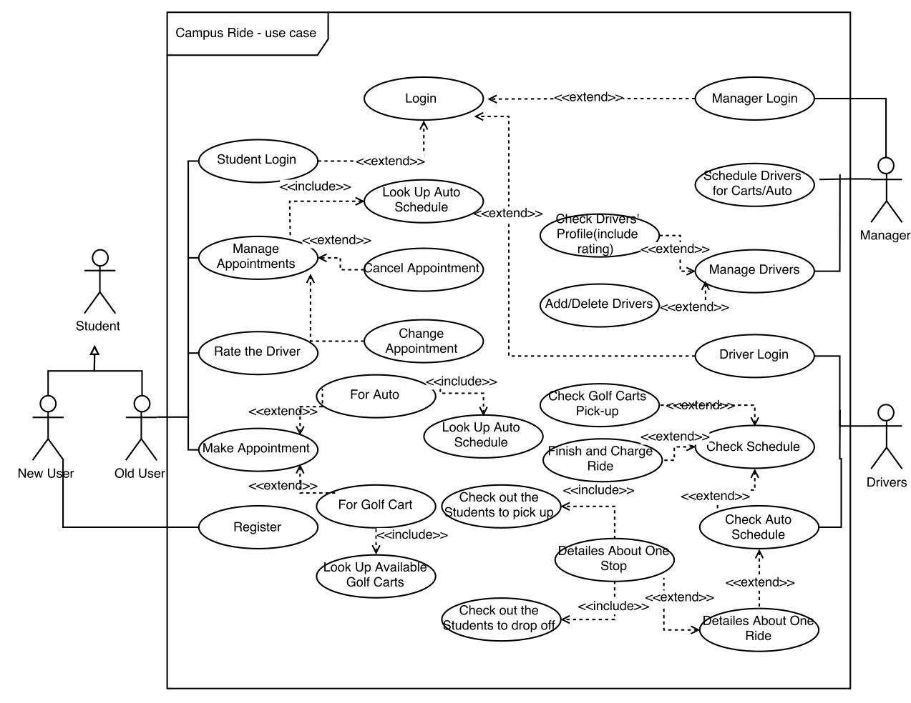
</p>


### Implemented Parts

For the database, it implements the whole part of the full use case including 12 tables with generalizaiton/specialization relationship. In this web application, due to the time limitation, I only implemented some key functionalities of the student user part, which includes **looking up auto/cart schedule timetable, registration, log in, log out, make/look up/cancel appointments, look up/update profile**. 

### More About Auto Ride

The auto ride has scheduled lines and timetable. Each auto with associated timetable would be assigned to a driver on spercific working day by the manager. After manager's schedule, student can look up and see the scheduled auto ride timetable by choosing the pick up stop, drop off stop and date. Right now, for the test data (which is included in SQL dump file), I use the existing [UNCC Next Ride](http://nextride.uncc.edu/). The stop information is refrenced from https://pats.uncc.edu/transportation/transportation-tracking. The routes in the next ride, gold, silver and green line are corresponding to line 0, 1, 2 in SQL route table. 

### More About Cart Ride

Cart ride and have customizable pick up time and do not need set the spercific drop off location. Thus, it is more flexible and maybe chargeable. For the pick up communication concern, it should have spercific pick up location at the time making appointment. Each scheduled cart with assigned driver could only have one appointment within half hour.

## Web UI 

The frontend use React 4 + Bootstrap 4. The view part is based on the theme/template from Creative Tim's [Light Bootstrap Dashboard](https://www.creative-tim.com/product/light-bootstrap-dashboard). 

### Public/Guest Time Table Look Up

**Without login** , the guest user can look up the scheduled auto time table by choosing date, pick up stop and drop off stop. The auto time table shows the scheduled auto ride with spercific pick up time and drop off time. It only shows the auto ride with seats lelf. Also, by choosing the date and pick up stop, the guest user can also look up the available cart with assigned driver. Each golf cart with assigned driver can only have one appointment within half hour.

<p align='center'>
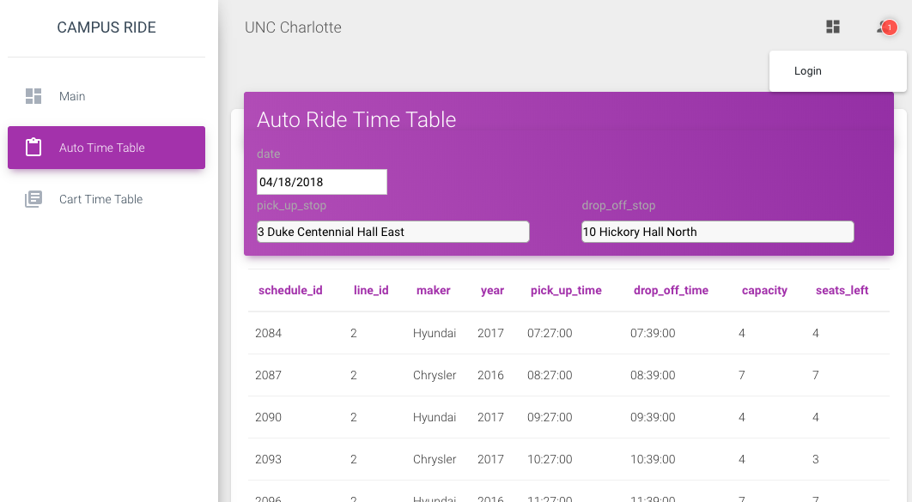
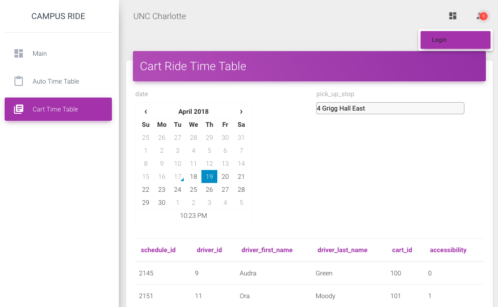
</p>

### User Authentification

In order to have full functionalities, the user is required to login. The current emplimentation of user authentification system use JWT based [Auth0](https://auth0.com/). For better backend compatibility, I suggest use google connection besides the native registration and login support. 

<p align='center'>
    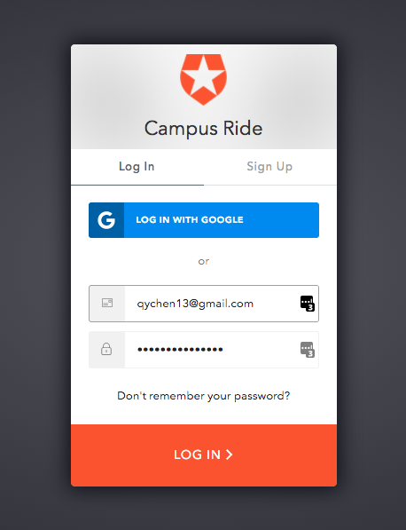
</p>

### Manage Appointments (create, look up and cancel)

**After login**, 
* the user can *make* new appointments:

<p align='center'>
   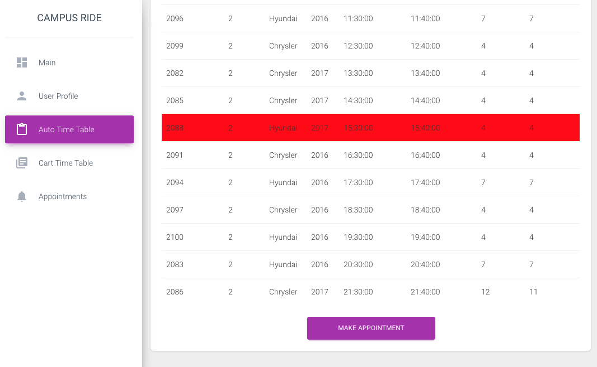
   
</p>

* *look up* and *cancel* appointment information:

<p align='center'>
   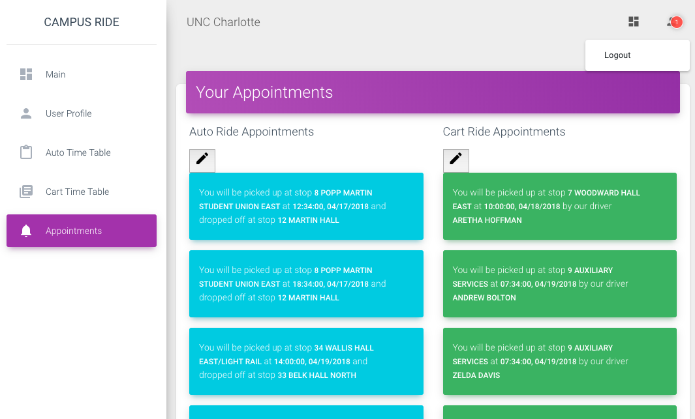
</p>

### Manage Profile 

**After login**, the user can look up the user profile stored in the system. For the user login via google account, the system could automaticaly retrieve the user profile information, e.g. first name, last name and email from google account. 

<p align='center'>
   
</p>


## EERD

The database design contains 13 tables. It has the following assumption/rules:

* Each route(or Line) has a fixed sequence of stops and the elapse time from the first stop

* Each auto has fixed timetable with a line and spercific staring time

* Each auto would be assigned to a driver by manager which represented by the Schedule table in the design

* Each cart would be assigned to a driver by manager which also included in the Schedule table in the design

* Cart ride appointment is chargeable and has custermizable pick up time without spercific drop off location

* Auto ride appointment has pick up stop and drop off stop along with the spercific route time schedule


<p align='center'>
   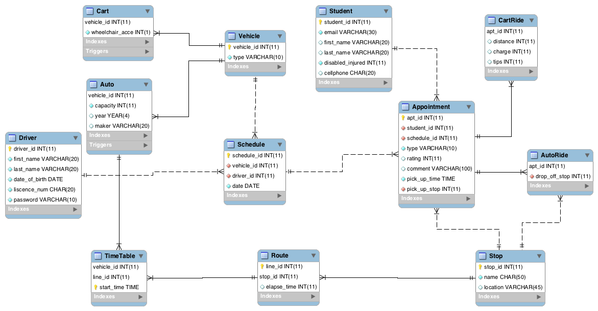
</p>

### Generalization / Specialization

In the design, Vehicle is the **generalization** for the Cart and Auto. CartRide and AutoRide are **specialization** for the Appointment with common attribute, *apt_id, student_id, schedule_id, rating, comment, pick_up_time and pick_up_stop*.  

## Data Dictionary

### Vehicle and Auto Time Table

<p align='center'>
   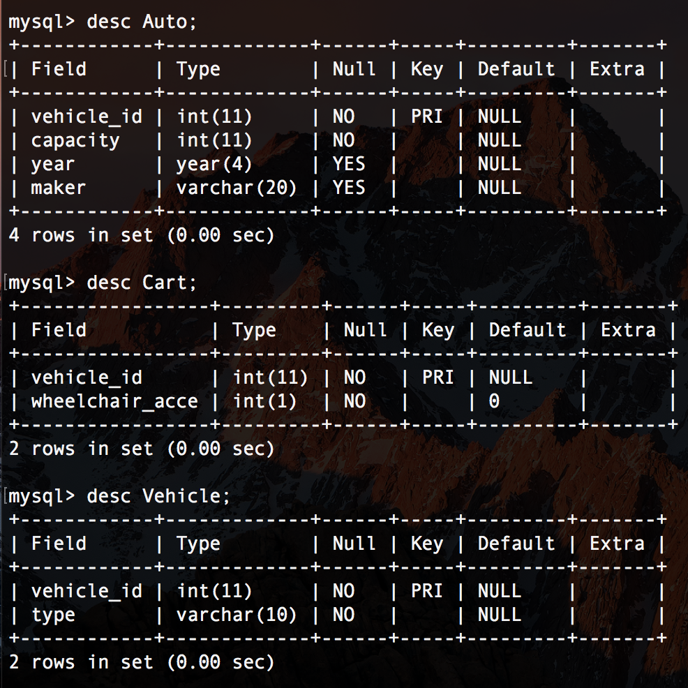
   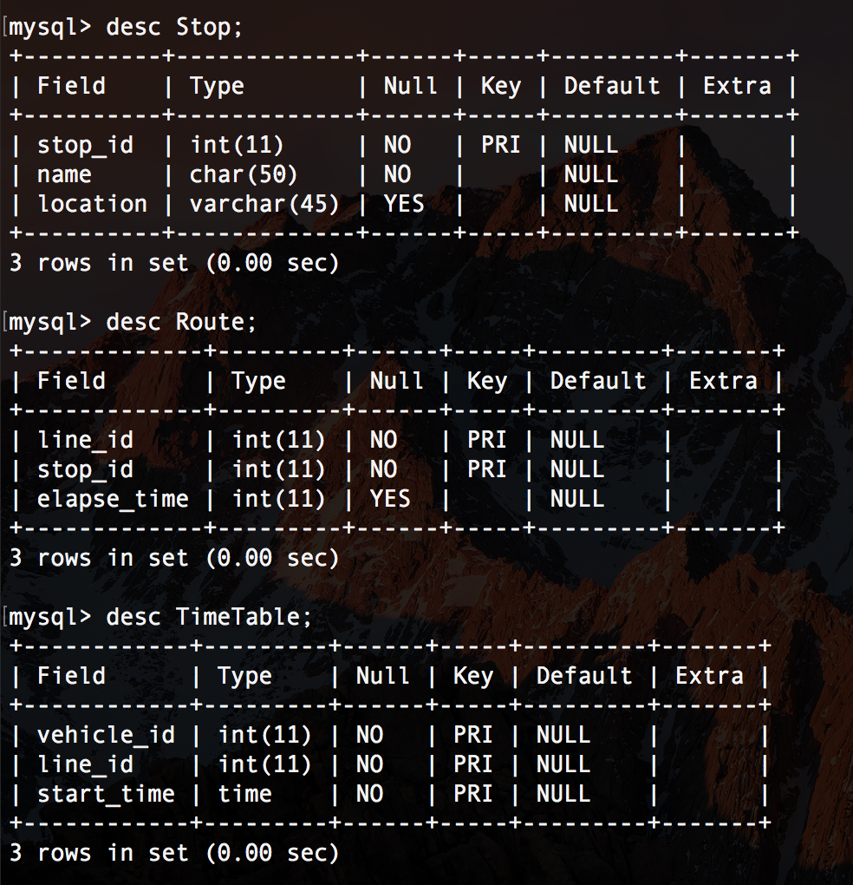
</p>

### Driver and Schedule

<p align='center'>
   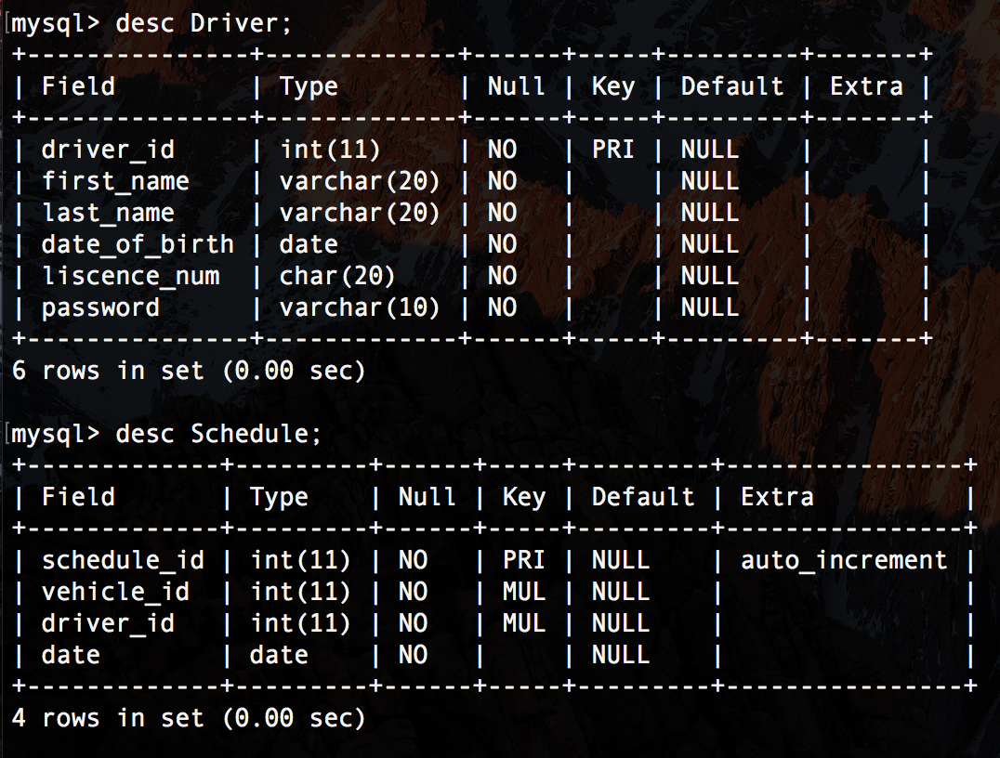
</p>

### Student and Appointment

<p align='center'>
   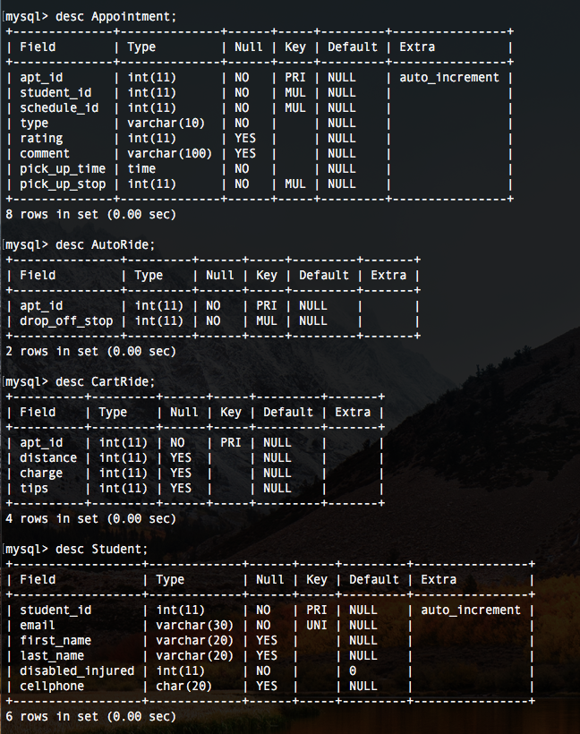
</p>

## SQL Implementation Details

### Stored Procedure 

```mysql
CREATE DEFINER=`root`@`localhost` PROCEDURE `insert_auto_ride`(stu_id int, sche_id int, pik_time time, pik_stop int, drop_stop int)
begin
	insert into Appointment(student_id, schedule_id, type, pick_up_time, pick_up_stop)
	values(stu_id, sche_id, 'auto', pik_time, pik_stop);
	set @apt_id = (select last_insert_id());
	insert into AutoRide(apt_id, drop_off_stop)
	values(@apt_id, drop_stop);
end
```

### Trigger

```mysql
CREATE DEFINER=`root`@`localhost` TRIGGER `CampusRide`.`Auto_BEFORE_INSERT` 
before INSERT ON `Auto` 
FOR EACH ROW
BEGIN
	insert into Vehicle
    values(new.vehicle_id, 'auto');
END

CREATE DEFINER=`root`@`localhost` TRIGGER `CampusRide`.`Cart_BRFORE_INSERT` 
before INSERT ON `Cart` 
FOR EACH ROW
BEGIN
	insert into Vehicle
    values(new.vehicle_id, 'cart');
END
```

### CRUD API

* Public API (without user authentification)
  * **Read** <a id='auto-query'>Auto Time Table</a>: 
    ```javascript
    // in ./backend/routes/public.js
    /* version one
            let sql = 'select schedule_id, line_id, maker, capacity, year, pick_up_time, drop_off_time '+
                      ' from StopTimeTable, Schedule, Auto '+
                      ' where pick_up_stop='+pick_up_stop+
                      ' and drop_off_stop='+drop_off_stop+
                      ' and date='+date+
                      ' and Schedule.vehicle_id=StopTimeTable.vehicle_id '+
                      ' and Schedule.vehicle_id=Auto.vehicle_id'+
                      ' order by pick_up_time';
    */
    // version three: support seats_left query
            let AppointmentTable = '(select Appointment.apt_id, Appointment.schedule_id, stoptimetable.vehicle_id, stoptimetable.pick_up_time, drop_off_time '+
                                    ' from Appointment, AutoRide, Schedule, stoptimetable '+
                                    ' where '+
                                    ' Appointment.type=\'auto\' and date='+date+
                                    ' and Appointment.apt_id=AutoRide.apt_id '+
                                    ' and Schedule.schedule_id=Appointment.schedule_id '+
                                    ' and stoptimetable.vehicle_id = Schedule.vehicle_id '+
                                    ' and stoptimetable.drop_off_stop = AutoRide.drop_off_stop '+
                                    ' and stoptimetable.pick_up_stop = Appointment.pick_up_stop) AppointmentTable ';
            let SelectedStopTimeTable = '(select line_id, vehicle_id, pick_up_time, drop_off_time from stoptimetable '+
                                    ' where pick_up_stop='+pick_up_stop+' and drop_off_stop='+drop_off_stop+') SelectedStopTimeTable';
            let LeftJoinTable = '(select SelectedStopTimeTable.*, apt_id from '+
                                  SelectedStopTimeTable + ' left join '+ AppointmentTable +
                                  ' on SelectedStopTimeTable.vehicle_id=AppointmentTable.vehicle_id '+
                                  ' and not SelectedStopTimeTable.pick_up_time>AppointmentTable.drop_off_time '+
                                  ' and not SelectedStopTimeTable.drop_off_time<AppointmentTable.pick_up_time) T';
            let AptCountTable = '(select vehicle_id, line_id, pick_up_time, drop_off_time, count(apt_id) as apt_count from '+
                                LeftJoinTable+' group by vehicle_id, pick_up_time, drop_off_time, line_id) AptCountTable ';
            let FinalTable = 'select schedule_id, line_id, maker, year, pick_up_time, drop_off_time, capacity, capacity-apt_count as seats_left '+
                              ' from '+AptCountTable+ ', Schedule, Auto '+
                              ' where date='+date+' and Schedule.vehicle_id=AptCountTable.vehicle_id and Auto.vehicle_id=Schedule.vehicle_id and capacity>apt_count '+
                              ' order by pick_up_time';
    ```
    
   * **Read** Auto Ride Table:
        ```javascript
        // in ./backend/routes/public.js
        // As requirement, each auto ride with assigned driver can only have one appointment within 0.5 hour
        const datetime = moment(req.body.datetime);
        let date = datetime.format('YYYY-MM-DD');
        date = '\''+date+'\'';
        let time1 = datetime.subtract(0.5,'hours').format('hh:mm')
        time1 = '\'{}\''.format(time1);
        let time2 = datetime.add(1, 'hours').format('hh:mm');
        time2 = '\'{}\''.format(time2);
        let sql =
                  ' select schedule_id, Driver.driver_id, first_name as driver_first_name, last_name as driver_last_name, Cart.vehicle_id as cart_id, wheelchair_acce as accessibility from Schedule, Cart, Driver '+
                    ' where date={} '.format(date)+
                    ' and Cart.vehicle_id=Schedule.vehicle_id and Driver.driver_id=Schedule.driver_id '+
                    ' and not exists '+
                    ' (select * from Appointment where schedule_id=Schedule.schedule_id '+
                    ' and pick_up_time>{} and pick_up_time<{})'.format(time1, time2);
        ```

* API Required Authentification
    * **Create** Appointment:
        ```javascript
        // in ./backend/routes/student.js
        if(req.body.pick_up_stop&&req.body.pick_up_time)
        req.body.student_id = req.user.student_id;
        // auto ride: call stored procedure 
        if(req.body.drop_off_stop){
          let sql = 'call insert_auto_ride('+
          '{student_id}, {schedule_id}, \'{pick_up_time}\', {pick_up_stop}, {drop_off_stop})'.format(req.body);
          return update_data(sql)(req, res, next);
        }// private ride
        else{
          let sql = 'insert into Appointment(student_id, schedule_id, type, pick_up_time, pick_up_stop)'+
          ' values({student_id}, {schedule_id}, \'cart\', \'{pick_up_time}\', {pick_up_stop})'.format(req.body);
          return update_data(sql)(req, res, next);
        }
        ```
    * **Update** Profile:
        ```javascript 
        // in ./backend/routes/student.js
        let sql='update Student set first_name=\'{first_name}\', last_name=\'{last_name}\', disabled_injured={disabled_injured}, cellphone=\'{cellphone}\' '.format(req.body);
        sql+=' where student_id='+req.user.student_id;
        ```
    * **Delete** Appointment:
        ```javascript
        // in ./backend/routes/student.js
            process_data = async (req, res, next)=>{
          if(req.body.apt_ids){
            const {findUserByAppointment} = require('../utils/user.js');
            let student_id;
            let sql='delete from Appointment where ';
            let index = 0;
            for(let apt_id of req.body.apt_ids){
              student_id = await findUserByAppointment(apt_id);
              if(student_id!=req.user.student_id){
                res.status(401).send(); // unauthorized error
                return ;
              }
              if(index===0) sql+=' apt_id='+apt_id;
              else sql += ' or apt_id='+apt_id;
              index+=1;
            }
            if(index==0) return next();
            return update_data(sql)(req, res, next);
          }
          next();
          }
        ```
        In order to make sure the cancelation appointments belong to the requested user, e.g. malicious user may send manually crafted http request to backend API with appointment not made by himself, it checks every appointment's owner before cancellation by call *findUserByAppointment* function.
    
    * For more **Read** API for authentification users, e.g. read appointments, check out *./backend/routes/student.js* file.
    
        

### View

 ```mysql
 CREATE DEFINER=`root`@`localhost` PROCEDURE `insert_auto_ride`(stu_id int, sche_id int, pik_time time, pik_stop int, drop_stop int)
begin
	insert into Appointment(student_id, schedule_id, type, pick_up_time, pick_up_stop)
	values(stu_id, sche_id, 'auto', pik_time, pik_stop);
	set @apt_id = (select last_insert_id());
	insert into AutoRide(apt_id, drop_off_stop)
	values(@apt_id, drop_stop);
end
 ```
 
### Indexes

## ToDo

* Optimize Auto Time Table Query:

    As can be seen in the <a href='#auto-query'>CRUD API</a> section, it much complex even with the *stoptimetable* view created. Moreover, it is the most frequent query in the application. Thus, some denormalization and redundant attribute (e.g. drop off time) should made for efficiency.
 
* Develop Manager Web UI and Backend API:
    Right now, in order maintain the usage of the application for test or other use, the schedule can only be made directly to the database. In the [./mysql-database/test-data-generator/schedule.py](https://github.com/qychen13/CampusRide-React-Express-MySQL/blob/master/mysql-database/test-data-generator/schedule.py), it contains the script to generate MySQL syntax for the new schedule.

## References

* Javascript
  * [ES6](https://developer.mozilla.org/en-US/docs/Web/JavaScript): complete tutorials about javascript including ES6 features

* Frontend
  * [React Official Documentation](https://reactjs.org/): the well organized official documentation and tutorial
  * [Create React App](https://github.com/facebook/create-react-app): a very good quick starting point without a lot of setup about WebPack, Babel 
  * [Creative Tim](https://www.creative-tim.com/): the well designed bootstrap themes/templates for views
  
* Backend
  * [Express JS](https://expressjs.com/): the most popular node.js web module 
  * [Express Generator](https://expressjs.com/en/starter/generator.html): a very good quick starting point with well organized development structure

* Auth0
  * [backend node.js setup](https://auth0.com/docs/quickstart/webapp/nodejs/01-login)
  * [frontend react setup](https://auth0.com/docs/quickstart/spa/react/01-login)

  


